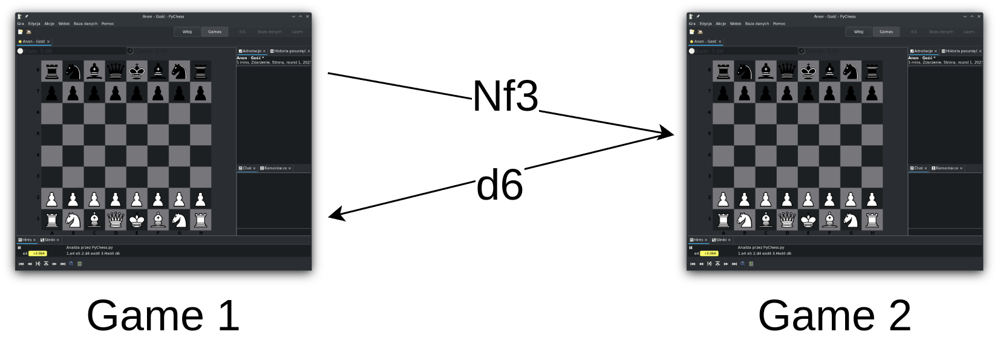
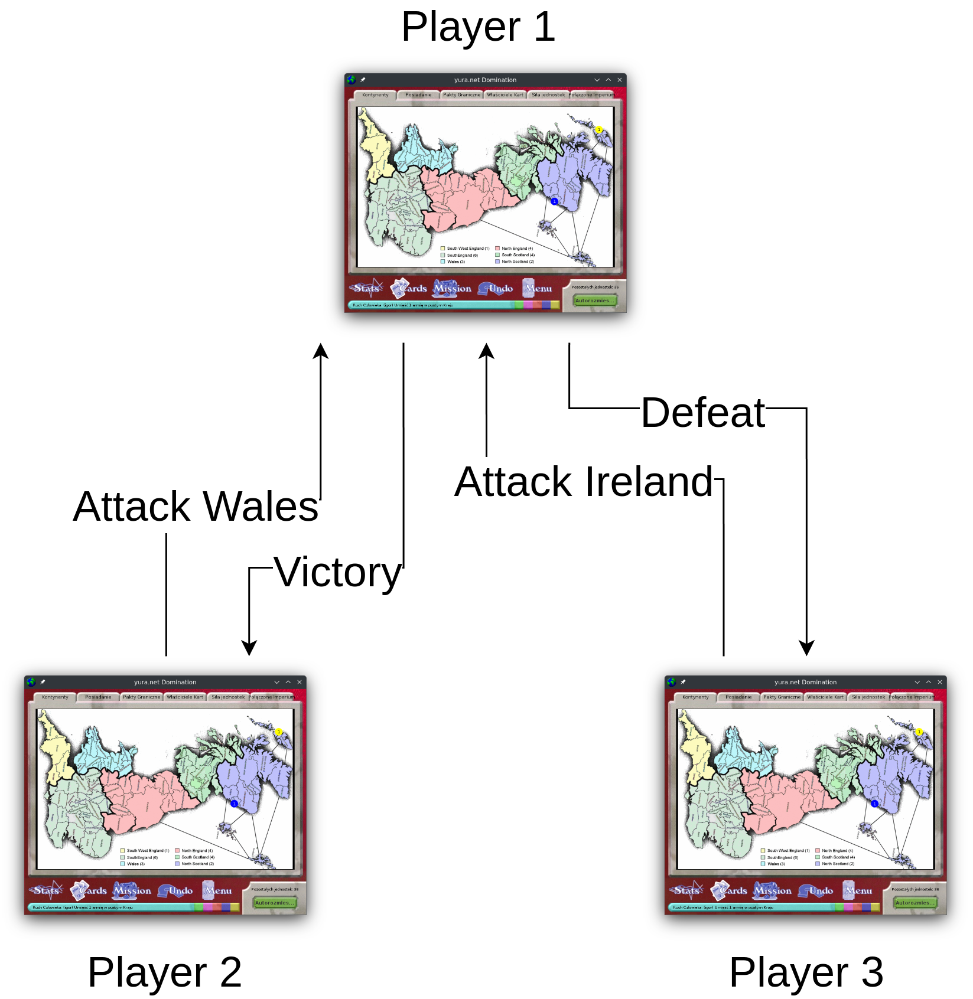

.. _Technical stuff part 1:

Video games, multiplayer and servers
====================================

In order to get a picture of how hard or easy it is to support a server for a
video game, one needs to understand how online multiplayer works. This chapter
shows examples how a multiplayer game can work, and that it possible for a
community of players to support a gamd once a publisher ends official support.

Video games are, at their core, programs that a player runs on his computer.
They run their code on the machine, output graphics and sound and react to
player input. A simplest example would be a single player chess program: it
draws the chessboard on the screen, it reacts to the player inputting moves,
and it calculates and makes the move of a computer opponent.

.. figure:: assets/chess_example_1.png
   :width: 400

   Pychess, a free chess program

A video game that wants to support playing with other people over the Internet
needs to be able to connect to and talk to another game running on another
player's computer. From a programmer's point of view, the Internet is just
another input and output: the game sends messages out and reacts to messages
coming in. For example, two chess programs can talk over the Internet,
exchanging moves done by each player, each updating the state of the game
independently. This style of online multiplayer is called "peer-to-peer".
It is used for example by the original first person shooter game "Doom".

   Simple "peer-to-peer" multiplayer

While simple, this style of multiplayer is difficult to work with in more
complex games. Often it is easier to track the game's state in just one
player's game. That player then acts like a "game master" or a "server" to all
the other players (the "clients"), telling them what state the game is in.

   Game of risk. Player 1 is the "server" for players 2 and 3.

A variant of this "client-server" model is a so-called dedicated server. A
dedicated server is a game program that is stripped of all the player-facing
components like graphics and player input and which only talks over the
internet and holds the game's state. In this model, all the players connect to
such a server as client. Such a server is still just a program, so it can run
on any computer. It can, for example, run on a player's own computer, or on a
computer rented from a hosting company.

Today's AAA multiplayer videogames often rely on multiple dedicated servers
that are much more complicated to setup that a single server program
described above. These can take different forms and be responsible for
different things, such as:

* Databases which hold, update and serve player data,
* Payment processing servers which talk to third-party payment services,
* Game servers that manage game state, with their number dynamically scaled
  using orchestration,
* Servers used for Digital Rights Management,
* Lobby and matchmaking servers,
* Voice chat,
* Game forums,
* And more.

However, the fundamentals of these complex sets of servers are the same: it is
a collection of programs that game clients send messages to and receive message
from. There's nothing inherent about servers that requires the publisher
specifically to operate them. And so, some games for which the official servers
were shut down have been restored to a reasonably playable state by fan
communities.

Community servers
-----------------

Some multiplayer games that require complex server infrastructure were
preserved by fan communities after the publisher ended support for multiplayer
components. Not all of these games became non-functional after support ended;
examples listed here serve as proof that such games can still be preserved and
maintained by fans.

Supreme Commander: Forged Alliance
^^^^^^^^^^^^^^^^^^^^^^^^^^^^^^^^^^

Supreme Commander: Forged Alliance is a real time strategy game released in
2007. The game supports peer-to-peer online multiplayer. Its developer, Gas
Powered Games, also operated a multiplayer service "GPGNet" which provided
matchmaking, downloading player-made maps and mods, chat, archive of past
multiplayer games and so on. GPGNet was shutdown in 2012. [1]_ Matchmaking
continued to be available through Steam, leaving the game in a playable state.

"FAForever" [2]_ is a fan project which works as a replacement for GPGNet. It
provides matchmaking, player-made maps and mods, chat, past game archive, as
well as new services like improved peer-to-peer connectivity and proxy servers.
The server code is maintained by volunteers and runs on rented computers paid
for by community donations.

City of Heroes
^^^^^^^^^^^^^^

City of Heroes is a multiplayer role playing game (MMORPG) released in 2004. It
operated until 2012 when the official servers were shut down. MMORPG servers
are especially difficult to recreate because they maintain a persistent game
word for hundreds of players, with much of game logic only calculated
server-side.

A fan implementation of the game's server called "SCoRE" was developed in
secret since shutdown of the official servers, until its existence was leaked
in 2019. [3]_ There are multiple private servers operated using this fan
implementation, with the largest called "Homecoming" boasting 1500 concurrent
players. [4]_ In 2024, developers of the "Homecoming" server were granted by the
publisher NCsoft an official license to host the game. [5]_

Battleforge
^^^^^^^^^^^

Battleforge is an online-only real time strategy game released by Electronic
Arts in 2009. Official servers have been shut down in 2013, making the game
inoperable. [6]_

A fan server implementation "Skylords Reborn" started development in 2015 and
was released in 2020. [7]_. Today Skylords Reborn has over 100,000 registered
player accounts. [TODO: describe server infrastructure here. I asked about it
on Skylords Reborn discord.]

.. [1] https://web.archive.org/web/20140903143132/http://forums.gaspowered.com/viewtopic.php?f=67&t=57459
.. [2] https://faforever.com/
.. [3] https://www.pcgamer.com/after-a-secret-server-shocked-the-community-100000-fans-are-finally-playing-city-of-heroes-again/
.. [4] https://forums.homecomingservers.com/status/
.. [5] https://www.vg247.com/city-of-heroes-ncsoft-licenses-fan-run-server-homecoming
.. [6] https://web.archive.org/web/20130910060412/http://forums.battleforge.com/forum/showthread.php?t=80261
.. [7] https://forum.skylords.eu/index.php?/topic/9024-want-to-help-improving-skylords-reborn-read-this-first/
