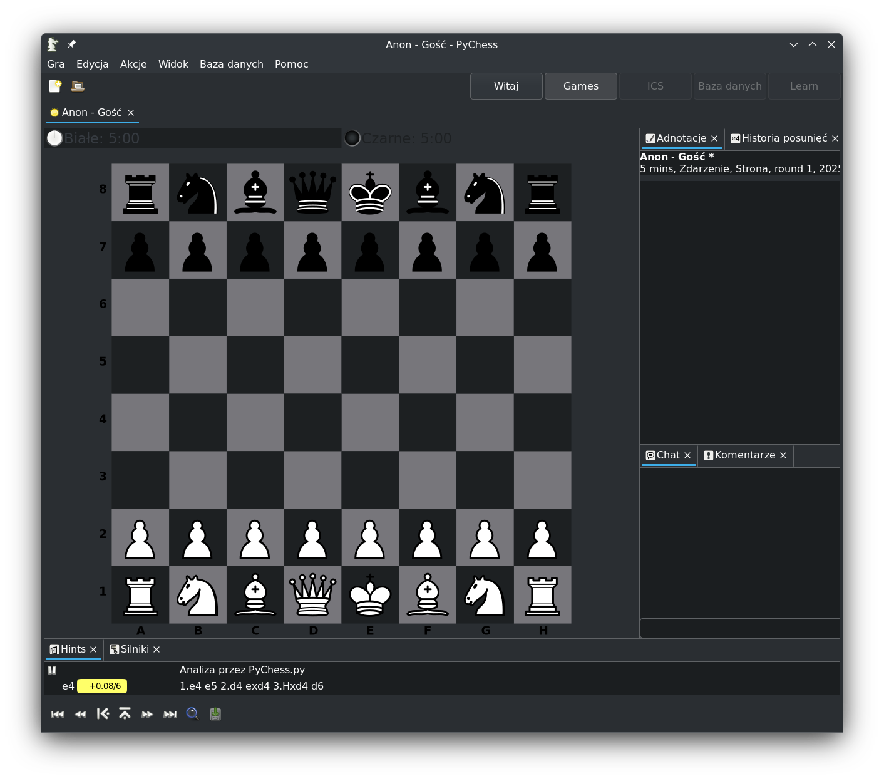

.. _Technical stuff part 1:

Video games, multiplayer and servers
====================================

In order to get a picture of how hard or easy it is to support a server for a
video game, one needs to understand how online multiplayer works. This chapter
show examples how a multiplayer game can work and aims to show that it is
possible for a community of players to support it once a publisher ends
official support.

Video games are, at their core, programs that a player runs on his computer.
They run their code on the machine, output graphics and sound and react to
player input. A simplest example would be a single player chess program: it
draws the chessboard on the screen, it reacts to the player inputting moves,
and it calculates and makes the move of a computer opponent.

   Pychess, a free chess program

A video game that wants to support playing with other people over the Internet
needs to be able to connect to and talk to another game running on another
player's computer. From a programmer's point of view, the Internet is just
another input and output: the game sends messages out and reacts to messages
coming in. For example, two chess programs can talk over the Internet,
exchanging moves done by each player, each updating the state of the game
independently. This style of online multiplayer is called "peer-to-peer".
It is used for example by the original first person shooter game "Doom".

.. figure:: assets/chess_example_2.png
   :width: 600

   Simple "peer-to-peer" multiplayer

While simple, this style of multiplayer is difficult to work with in more
complex games. Often it is easier to track the game's state in just one
player's game. That player then acts like a "game master" or a "server" to all
the other players (the "clients"), telling them what state the game is in.

.. figure:: assets/chess_example_3.png
   :width: 600

   Game of risk. Player 1 is the "server" for players 2 and 3.

A variant of this "client-server" model is a so-called dedicated server. A
dedicated server is a game program that is stripped of all the player-facing
components like graphics and player input and which only talks over the
internet and holds the game's state. In this model, all the players connect to
such a server as client. Such a server is still just a program, so it can run
on any computer. It can, for example, run on a player's own computer, or on a
computer rented from a hosting company.

Today's AAA multiplayer videogames often rely on multiple dedicated servers
that are much more complicated to setup that a single server program
described above. These can take different forms and be responsible for
different things, such as:

* Databases which hold, update and serve player data,
* Payment processing servers which talk to third-party payment services,
* Game servers that manage game state, with their number dynamically scaled
  using orchestration,
* Servers used for Digital Rights Management,
* Lobby and matchmaking servers,
* Voice chat,
* Game forums,
* And more.

However, the fundamentals of these complex sets of servers are the same: it is
a collection of programs that game clients send messages to and receive message
from. There's nothing inherent about servers that requires the publisher
specifically to operate them. And so, some games for which the official servers
were shut down have been restored to a resonably playable state by their player
communities.

[TODO: one more section here that describes notable community server success
stories.]
