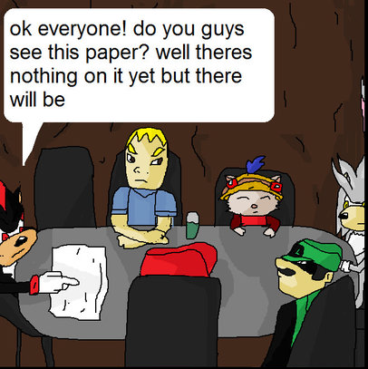

Non gamer moriar: why you shouldn't kill games or something
===========================================================

Title page will go here.

`Github page for collaboration <https://github.com/Wesmania/game-life-report>`_.

**Chapters to write (mostly inspired by "Deere in the Headlights"):**

Summary
-------

This is about videogames. Games are multiplayer. Videogame companies started
doing something and we argue that it's bad, something should be done about it.
They say it's necessary, we prove they're wrong.

* Short history.

  * Videogames are played, sometimes multiplayer.

  * It used to be a game had a multiplayer mode and came on disk and you always
    owned it.

  * Over time it changed: DRM, always online, not owning games. **Examples.**

* Why it's bad.

  * Planned obsolescence, how many games are destroyed nowadays. Show stats,
    prove that there is no recourse.

  * Players generally expect to keep the game like it's a book or a movie on a
    DVD, but games are taken away from them as if it's a service. (Vague.
    Describe that this is a legal gray area?)

  * Some kind of elegant justification that videogames are also cultural works
    and just like taking away books feels authoritarian and taboo, the same
    should happen for videogames.

* Briefly why videogame industry defends it.

  * Claims that it's too expensive to do. Say it's not.

  * Claims that the companies would have to support games forever. Say they won't.

  * Claims that they'd have to protect their property in one day or another.
    Say they wouldn't.

* Show that gamers don't like it.

  * Piracy, specifically in light of wanting to own your game.

  * Brief examples, gamers protesting DRM like Spore or one of SimCity games.

* Any mentions of movements prior to Stop Killing Games and prior laws.

Introduction
------------

* Anecdotal stories of games being killed. Obviously we can't beat "Deere in
  the Headlights" in terms of tangible harm done to someone.

  * Comparisons to earlier titles that work perfectly fine are valuable.

  * Challenge: how to portray this without looking to politicians like them
    silly kids complaining about having their toys taken away?

* Examples of players reverse engineering games or returning to old games.

  * Addendum: very few games nowadays get rescued from being killed.

  * Can we find an example of a company taking legal action against a community
    after the game was killed?

  * Can we find some legal argument that community servers are at least a gray area?

* Explanation that games are like movies or books in their cultural value.

  * Examples of prior law that stops killing books or movies.

**NOTE: At this point the politician has to be convinced that we have a point
and that games maybe shouldn't be killed. Much of the rest is spent justifying
that the games don't have to die, that it's not hard to not kill them and that
there's no good argument in favour of them dying.**

If what is written up to here is not enough, another chapter might be
necessary. It's a bit silly to expect someone to be convinced after just an
introduction.

Technical stuff part 1: multiplayer videogames
----------------------------------------------

* Videogames are programs you run on your computer and interact with. They can
  run only on your PC, or they can talk with other things on the Internet.

* Early multiplayer games. Games that just talk to each other over the
  Internet, like chess. Games where one of the sides is a "game master" or
  "server" running the calculations and keeping the state, while other players
  are "clients". Dedicated servers. A server is just another program you run on
  some computer.

* Briefly: modern games can be more complex. Multiplayer games with thousands
  of players can have many smaller servers working together to make them work.
  This does not necessarily mean the company has to support them for games to
  stay alive.

Technical stuff part 2: DRM
---------------------------

* Videogames used to be sold on physical medium and were just programs.
  This meant piracy. DRM was made to combat this.

* Early DRM was physical: hard to photocopy manuals, creative burning of CDs
  and so on. List examples.

* With easy Internet access, games started using it to employ DRM.

* Cryptography 101. A company can create a cryptographic key: a secret piece of
  data that can be used to mathematically prove things and encrypt things.

  * A game connects to company server and presents proof that player bought the
    game, created with the secret data. The server tells the game if proof of
    ownership is legitimate, and the game refuses to run if it's not.

  * Consequence: when the company takes down the server and does not publish
    the secret data, the game is inoperable.

  * Making the game operable is easy, just publish the secret. **Provide some
    examples of leaks.**

* Evolution of this: Denuvo. Brief description.

  * Parts of the game code itself are encrypted. Game has to show proof of
    ownership to the server repeatedly so that it the server give it the game
    code it should run.

  * Examples of games Denuvo has killed.

  * Removing Denuvo is easy. Examples. Does company making Denuvo say that
    themselves?

* Assertion: DRM is easy to remove and not a hurdle, but keeping it kills games
  with no recourse.

Technical stuff part 3: servers, communities and development cost
-----------------------------------------------------------------

* Game companies claim that making an end of life plan for a game is sometimes
  prohibitively expensive. **Here we prove them wrong.**

* Argument one: many games can run without a server of with stub functionality
  and still be reasonably playable (with minor degradation in functionality).

  * Examples: The Crew. Egregious examples: that one SimCity game that EA
    claimed has to be always online.

* Argument two: even games that have complex online components can be
  reasonably playable.

  * **Necessary to provide examples here.** Any online games publishers
    released offline modes for? MMO private servers?

  * Addendum: a lot of services like anticheat, DRM, payment processing are not
    necessary when ran privately or by the community.

* Argument three: during development games often have simplified multiplayer
  server setups anyway.

  * **THIS NEEDS GOOD, VERIFIABLE EXAMPLES. PREFERABLY VIDEOGAME TOOLING LEAKS.**

* Argument four: Gaming community can maintain and develop their own community
  multiplayer tools, even with as little as the developer not artificially
  killing a game.

  * **Examples here**. Private MMO servers for example. Writer's own example:
    FAForever, multiplayer support for Supreme Commander with tons of
    infrastructure that was done from scratch.

  * Addendum: community is able to technically run such servers.

    * Example: Oracle or Hetzner cloud/bare metal hosts, examples of games
      using those. Maybe some example of more complex stuff like Amazon?

Technical stuff conclusion:
---------------------------

Videogame companies do not have to support games forever for them to live after
being abandoned. Preparing the game to not die after it's released is not
expensive and community support often means video companies only have to expend
minimal effort, jest enough to not intentionally kill a game.

Legal stuff part 1: Companies are not legally liable for community servers
--------------------------------------------------------------------------

I do not know what should be written here. Someone with legal background is
needed. Some ideas:

* Companies are not responsible for players saying bad words or even doing
  illegal activity on community servers. Legal justification?

* Companies do not need to protect their intellectual property by shutting down
  community servers. Legal justification?

* Companies do not have to be liable for insecure or malfunctioning software
  after the game is abandoned.

  * I assume legal justification should be easy here? Open source software
    already has "ABSOLUTELY NO WARRANTY" clauses. Do any videogames have the
    same "no warranty" clauses as well? I'd expect them to.

* Companies have no legal ground to come after community servers to protect
  their brand.

  * **Quote the Video Games Europe argument here**. This might be good ground
    for some flashy and dramatic comparison, that this is a dystopian idea?

 * There are obviously many examples of community servers that are left alone,
   so surely companies do not feel threatened.

Legal stuff part 2: Community servers do not breach Companies' legal obligations
--------------------------------------------------------------------------------

Again, lawyer needed here.

* Companies are not required to disclose third party server software. See
  technical stuff part 3. Community can support the game even if very little is
  provided by the developer. A game can survive without disclosing that software.

  * Can we provide an example of a community server that just chose to use the
    same third party software or service?

* Licenses to musical and other non-software works do not hinder games staying
  alive.

  * If someone bought a game disc with licensed music and the license agreement
    expires, they still get to play they game with licensed music.

  * If licensed music is server side, not providing it is acceptable
    degradation of functionality.

* Companies do not have to provide players with ownership of the game itself
  for the game to not die.

  * This feels so obvious,but VGE still makes this argument. Lawyer needed here.

* Companies do not have to cross PEGI to allow games to live.

  * Show examples. Did you know that the game "FUEL" has a big disclaimer
    "online interactions not rated by ESRB", and yet still has the rating of
    "E"?

Misc
----

TODO: should anything else be mentioned here? Examples:

* We do NOT demand companies to support games forever.

* Community servers are NOT competition to the companies after the game is no
  longer supported, by definition.

* Taking away game ownership is NOT an acceptable consequence of a videogame
  company no longer wanting to support the online DRM. Give a good
  justification here!

* Having to compete with older games is NOT a justification for killing them.
  It wasn't a justification for books, wasn't for radio shows and movies,
  wasn't for theatre, isn't for videogames.

* The fact that online games receive updates with new content is NOT a
  justification to kill them once they stop being profitable. It is not the
  newness of the content that is the value added, it is the content itself.

* Requiring games to have an end-of-life plan will not hurt small games, nor
  will it discourage innovation.

Conclusion
----------

* Make some nice stories about how nobody will ever be able to drive all across
  the Unites States in The Crew ever again. Or any other such stories,
  especially for games with some artistic merit or a good story. Wasn't
  Destiny's story pretty decent, despite Bungie being Bungie?

* VGE makes this cynical argument about videogame preservation in museums and
  such. It would make a banger of an ending to refute that. If game code is
  preserved in a museum or an exhibition but no one can ever play and
  experience it ever again, can you call this game preserved? Would you call a
  book that no one can ever read preserved? Is a movie that no one can ever
  watch again because the technology to play the medium it is saved on no
  longer exists, preserved? Is a videogame?

A table of documents for stub chapters is listed below. You can fill in the
files in this directory using the summaries above as a guide.

.. toctree::
   :maxdepth: 2
   :caption: Contents:

   Summary
   Introduction
   Technical stuff part 1
   Technical stuff part 2
   Technical stuff part 3
   Technical stuff conclusion
   Legal stuff part 1
   Legal stuff part 2
   Misc
   Conclusion

